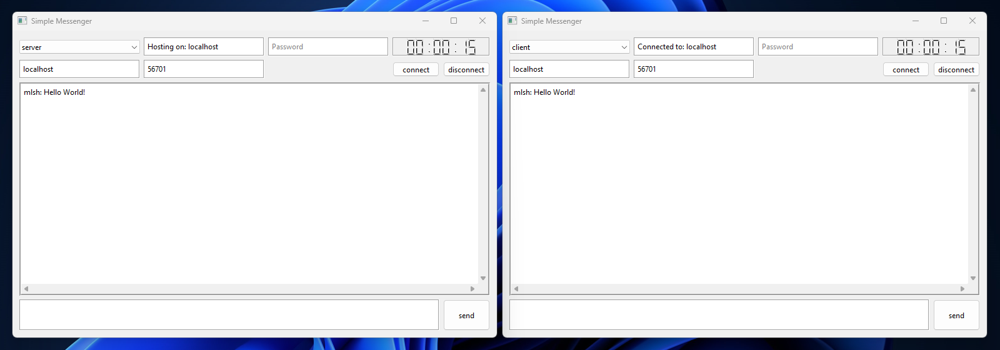
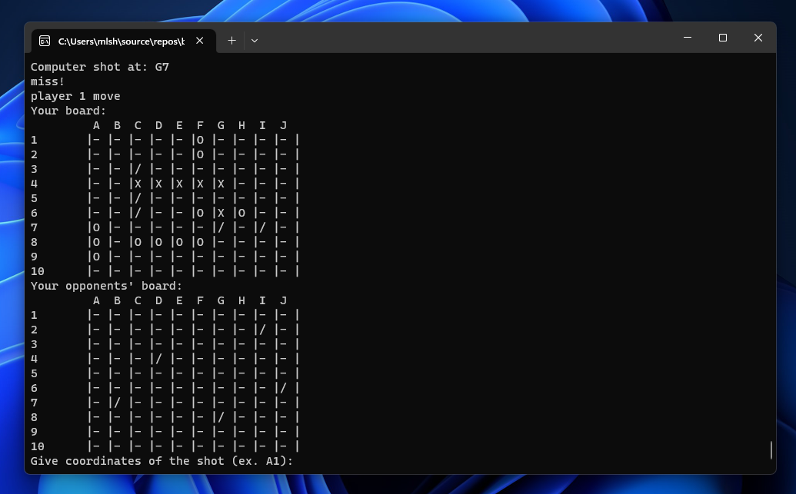

# Miłosz Maculewicz

` C++, Networks, Linux `

- I'm computer science student eager to learn everything that comes in my taking off IT career. Things I'm passionate about make me try my hardest to deepen my understanding in a given subject.
- Every coding project has to meet software engineering standards, follow design patterns and be well made from the ground up. I'm familiar with object oriented programming as well as advanced programming techniques, STL library and I'm studying Qt at this moment.
- Networks is something that keeps me going. I've created some simple socket apps making research on my own. I'm well up on used technologies and into basic cryptography systems like RSA.
- On the daily basis I'm a combo Windows/Linux user trying to optimise my time best possible way. Let's take a look at some code:)

## My projects:
### [Simple Qt Messenger](https://github.com/mldxo/Simple-Qt-and-Winsock-Messenger#readme)
It lets the server and the client connect and message each other.

### [Battleship console game](https://github.com/mldxo/Battleship-console-game#readme)
Battleship game, you can play either with your friend or versus Ai.

