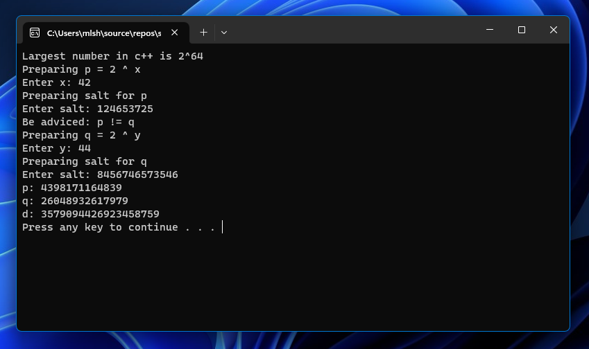
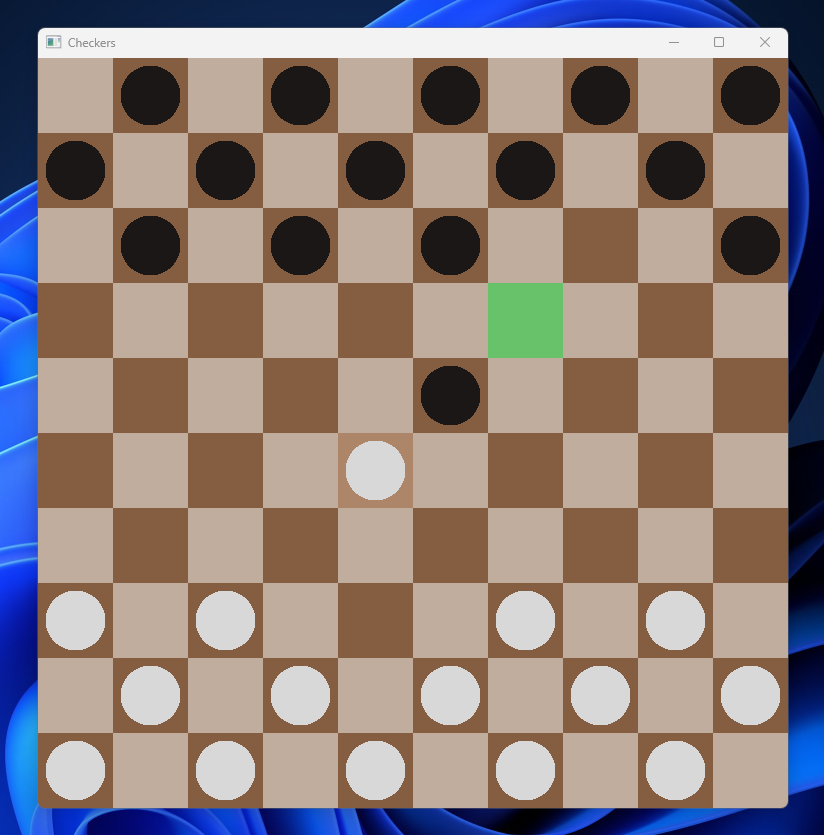

# Miłosz Maculewicz

` C/C++, Networks, Linux `

- I'm computer science student eager to learn everything that comes in my taking off IT career. Things I'm passionate about make me try my hardest to deepen my understanding in a given subject.
- Every coding project has to meet software engineering standards, follow design patterns and be well made from the ground up. I'm familiar with object oriented programming as well as advanced programming techniques, STL library and I'm studying Qt at this moment.
- Networks is something that keeps me going. I've created some simple socket apps making research on my own. I'm well up on used technologies and into basic cryptography systems like RSA.
- On the daily basis I'm a combo Windows/Linux user trying to optimise my time best possible way and get rid of every compilation warning. Let's take a look at some code:)

## My projects

### [RSA Key generator + text encryption](https://github.com/mldxo/rsa-keygen)
Fully functional tool generating RSA key pair. It supports big numbers and text encryption.

### [Battleship console game](https://github.com/mldxo/Battleship-console-game)
Cross-platform Battleship game with a makefile, you can play either with your friend or versus Ai. Program supports setting ship both manually and automatically.

### [Winsock Qt Messenger](https://github.com/mldxo/qt-messenger)
Online messenger connecting server and client letting them exchange messages. Project will have a better version in the future.

### [International draughts SFML game](https://github.com/mldxo/checkers-gui)
Checkers GUI game. Currently in early stage of completion, but functional in player vs player contest.

